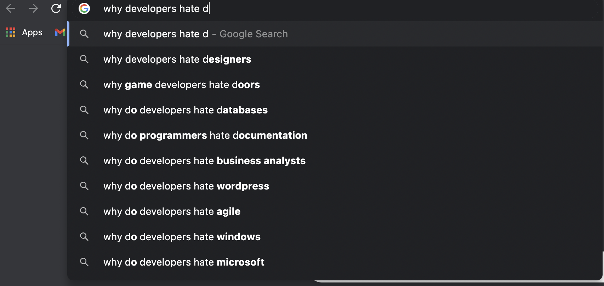
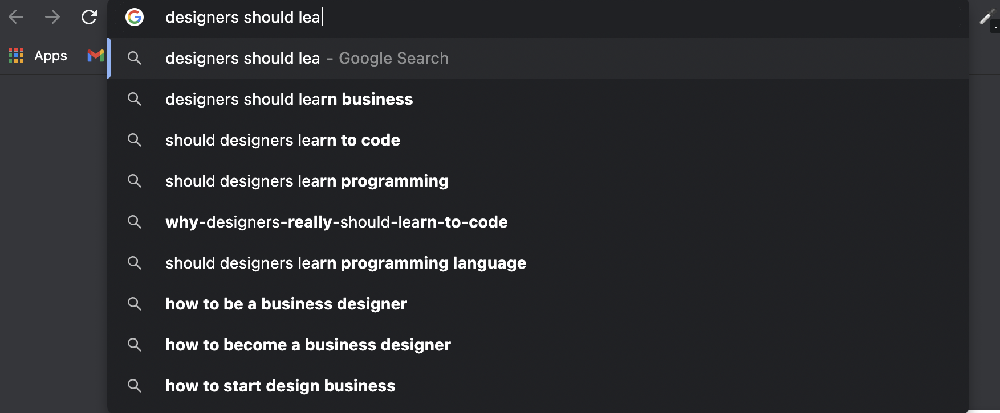
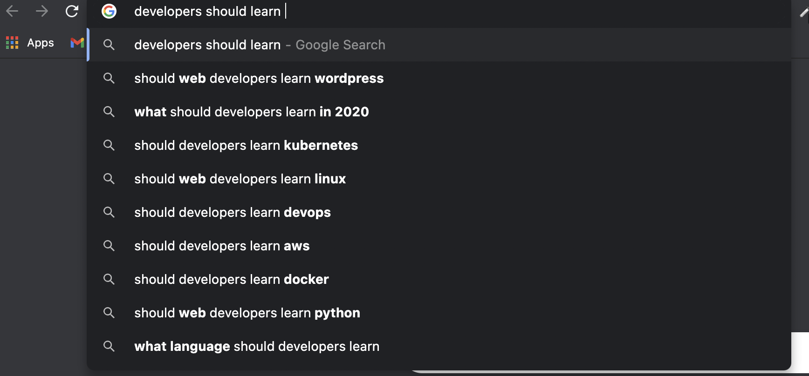

I am a Developer

I like Design

BUT, developers who don't understand design often hate designers.

To bridge the gap between the two, we often suggest designers should understand coding,

but not the other way around.

**Remember**,

1. Developers are designers too, just with a different medium
2. Understanding design can make you a better developer because you understand what  you are delivering to your user
3. Design choices are always logical
