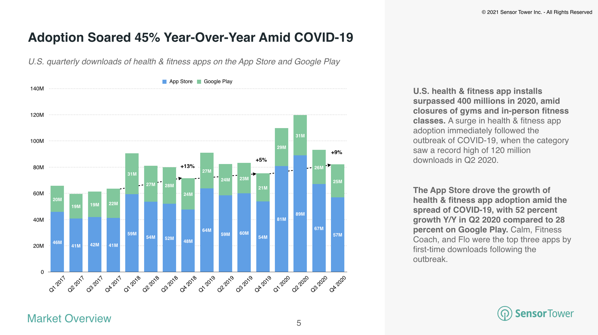
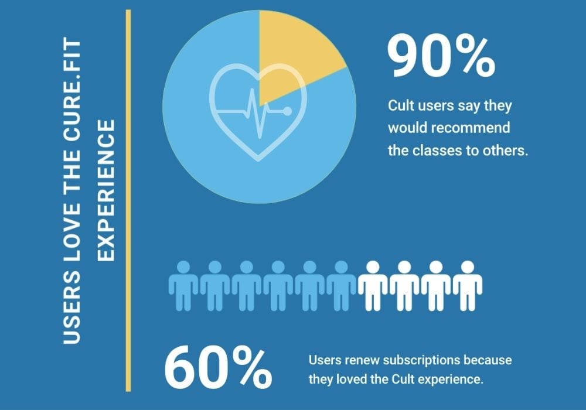

> There is one generation that has been consistently defined by its obsessions: avocado toast, memes, Harry Potter ... and self-care.

Millenials have been obssesing over Self-care like never before. According to data from multiple app store intelligence firms, the category is now seeing notable growth. As of the first quarter of 2018, the top 10 grossing self-care apps in the U.S. earned $15 million in combined iOS and Android revenue, and $27 million in worldwide revenue, according to Sensor Tower. Further, top 10 meditation apps pulled in $195M in 2019, up 52% from 2018. However, with the pandemic, U.S. health & fitness apps saw 405 million installs in 2020, up 22 percent from 332 million in 2019.

## The Indian Scenario

Indian apps such as Let’s Meditate, Wysa, the Sadhguru app and Innerhour have picked up millions of users, including a large chunk from abroad, even as international apps such as Calm and Headspace dominate the market with at least ten million users each. Pandemic has open an pandora box for such apps.

However, the Indian fitness app market has been seeing a much larger outburst. [Data](https://www.360iresearch.com/library/research-report/india-fitness-app-market) suggests, The India Fitness App Market size was estimated at USD 239.46 Million in 2020 and expected to reach USD 311.08 Million in 2021, at a Compound Annual Growth Rate (CAGR) 26.81% to reach USD 996.06 Million by 2026.

One of the big players in the market is <b>Cult.fit</b>. While it started with physical centers in major metro cities and was booming, the journey has been no less in the online mode. When the physical movement became meager, people started becoming concious about their physcial health. Cult.fit made a master stroke by collaborating with organizations to offer services to its employees and it started to catch up very easily with the Millenials and Gen-Z.

## Practicing Digital Wellbeing

I was reading an interesting [article](https://potential.app/ios-15-humane) encompassing digital wellbeing and how iOS settings can potentially help us free from the latches of persuasive design or addiction based businesses. If such digital wellbeing settings are implemented on an OS level, it might disrupt the AdTech market.

For quite sometime Apple has been calling out and taking shots on brands in the AdTech space for compromising the privacy of the users and have been implementing features in its iOS ecosystem that prevent data theft. With this, it would not be surprising to see Apple implementing something like this to have a much easier social detox.

But then if you think about it we often many of us break our own rules and revoke the restrictions even though we actually want to restrict it. It has got to to our habitual practice of mindless scrolling that we can't get over and so we go back to it rather than doing something fruitful. But, the bottom line is people think digital wellbeing is all fancy but super hard to follow.

In that case how can Apple create an exxperience to icentivize to follow such restrictions and make social detox as a recurring ritual?