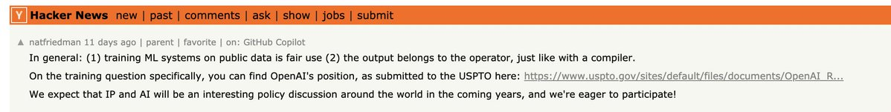
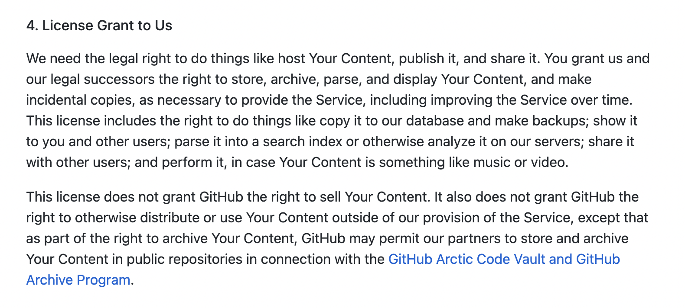
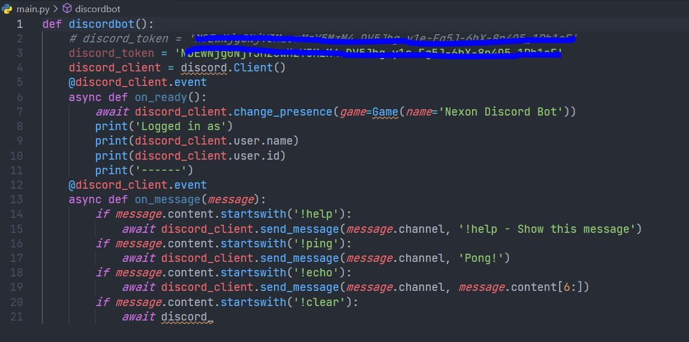

If you have ever committed you code in the Github public repository, it has been used by Github Copilot, also referred to as “your AI pair programmer”, the tool not only autocompletes lines of code but will offer entire blocks of code in response to both code that you type and natural language. However, it made a lot of commotion in the tech industry, and having been trained on billions of lines of public code, the question arises regarding the issues of copyright, specifically regarding the GPL license.

In short, GPL is a copyleft license. It requires that all derivative works carry that same license. Hence, the hubbub is all about GitHub profits from analyzing free software and builds a commercial service on it.

GitHub CEO Nat Friedman, however, commented on one of the Hacker News threads saying,

1. training ML systems on public data is fair use
2. the output belongs to the operator, just like with a compiler

Even the Github Docs, suggests, “the right to store, archive, parse, and display Your Content, and make incidental copies, as necessary to provide the Service, including improving the Service over time.”

It is been argued that simply reading and processing information is not an infringement act. However, what is furious for some people is having to compare a human reading a piece of text to an AI reading the same for training. But the catch here is making copies of content in order to process it. In response to this, experts mention that digital technology would be completely unusable if every technical copy required permission. Otherwise, people who listen to music with digital hearing aids would first have to acquire a licence for it.

A r[esearch paper by Alber Ziegler](https://docs.github.com/en/github/copilot/research-recitation) published by GitHub, which explained that in very few circumstances (0.1% of the time), Copilot could make a suggestion of code that already exists. Other times, it is uniquely generated. But there have been multiple instances where Github Copilot has seen to produced the exact same code, given out keys, used the same comments etc.

Bottom line, there hasn't been much clear in this context and a lot of conflicting opinions have risen. The main question that persists is whether the existing IP system needs to be modified to provide balanced protection for machine created works and inventions.