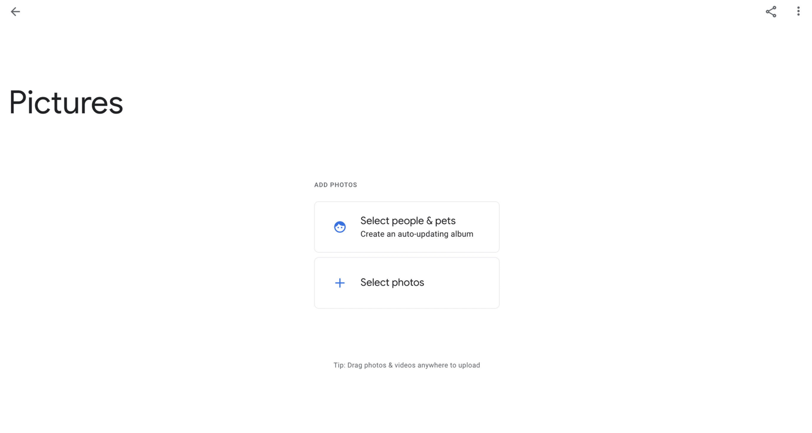
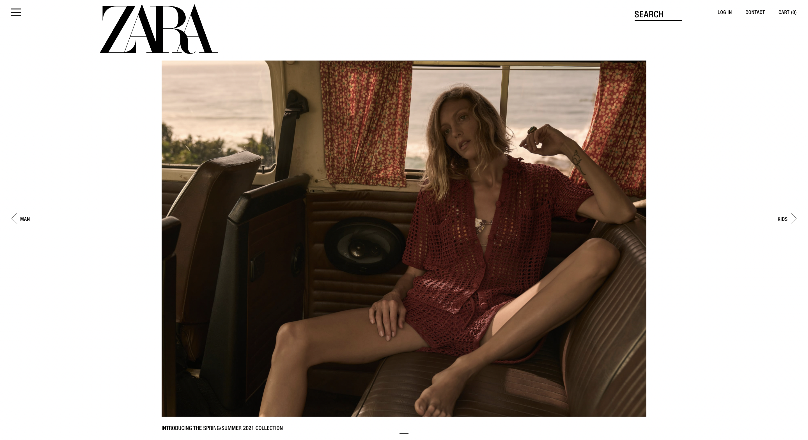

## Intuitive Design 

It is design which is familiar and can be used immediately without having to put a conscious thought to it. While what is it intuitive for you, might not be the same for someone else. Certain elements and actions tend to become intuitive while you keep searching for patterns all around the internet space. 

For example: The three lines stacked over one other is associated with hamburger menu because it is quite ubiquitous or we instinctually click on a bounding box with some text inside because we assume it to be button after having to identified the pattern.

But all of this is only possible because we are familiar with these patterns and have used it before. However, it's great to follow the approach to prevent the people from getting lost in the space and eventually lead to churning.

## Minimalistic Design

Minimalism carries the flag of "Less is More" and focuses on removing noise to avoid distraction and clutter and maintain its shape to bare minimum.

> By distilling a product, painting or subject down to its bare essentials, minimalists wanted to showcase its true form. 

Minimalism has become much popular among the design patterns to convey information in a new way by keeping the interface sleek and clean.

## Can Minimalism Backfire?

Minimalism is most of the times **not intuitive**. While maintaining to keep the interface to bare minimum, intuitive action points are often missed upon, making it hard for user to take control. 

While minimalism is artsy but for most most functional websites, it essential to consider the average user's perspective. They would prefer a content rich interface to perform actions rather than the ones with huge negative space.  

Taking Google Photos for reference where the UI is clean and minimalistic but does not highlight major CTAs. The album heading does not seem editable until focused. For a user landing on the screen the first time, the UI has no clear indication as to where to focus on.

Another "Minimalism gone wrong" example is the Zara Website. While the website looks all pleasing and aesthetic, it not only misses highlighting its CTAs but also fails accessibility guidelines with the text size being as small as 9px. The content is so pea-sized that it is barely visible to a person with normal eyesight. I had such a hard time figuring out how to add products to the cart and is such a bad use case for an online shopping website. On the contrast, Amazon, although content-rich is quite simple to use and thus serves the purpose.