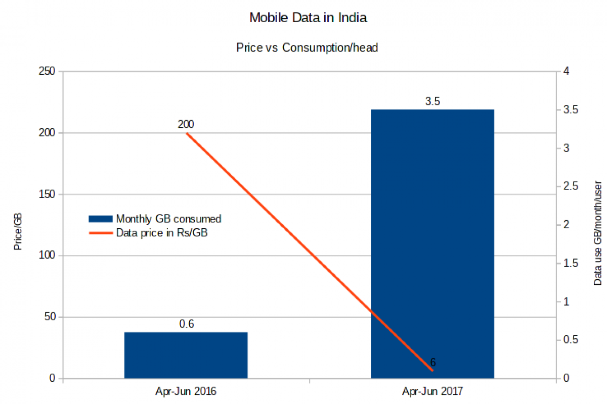
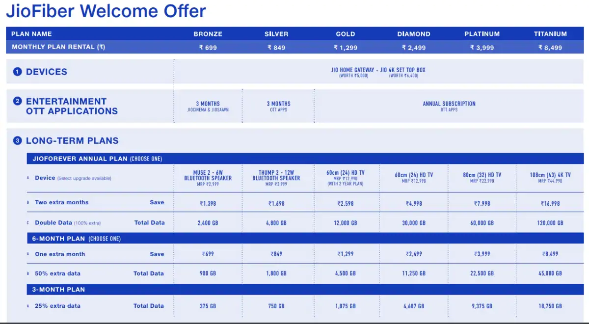
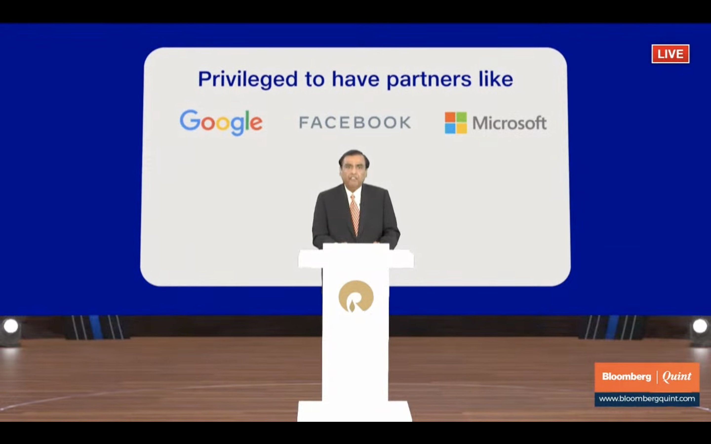

Every startup that has bloomed in this past decade, credits its success to two things: Demonetisation and Internet Penetration. I remember being back in 2016 when Jio sim was released, people were going mad just to avail themselves free internet for six months. I am still using one which I got back at that time. Most businessmen thought it as a cash burn on Ambani's end but that is what fetch Jio that largest market share in telco in such a short span. The result was Jio added 7 customers per second and India's monthly data consumption went up from 0.2 billion GB to 1.2 billion GB, a growth of 600 per cent.

> While it took 25 years for the Indian telecom industry to build its 2G network, Jio built its 4G network in only three years.

Cut to few years ahead, internet penetration has reached to even remotest of places with people consuming content on Youtube, FB, OTTs, Twitter etc because internet no longer costs ₹400 for 1GB/month. This tectonic shift led to competitors like Vodafone, Airtel, Idea surrender and resort to reducing their pricing to match the market price. It's a win-win for Jio and the general public.

## Delivering Network to homes

Jio took steps ahead to further expand its global connectivity by delivering a high-speed, low-latency optical fiber network to more than 50 million homes and premises, popularly called the Jio Fiber.

Jio again used the same approach for Fiber as well, it offered **Jio Fiber Welcome Offer** providing  set top box and router for free with all packs of up to 1Gbps. Subscribers got free premium subscription to OTT apps on JioFiber. On annual plans of Gold and above, they even offered a 24 or 32 inch free TV.

Jio had foreseen that a normal DTH setup box will not be enough for the people with access to internet connectivity and they would want much more on their screens to watch. The tie-up of fiber plans with OTT platforms with Live Jio TV will be everything you would want to have displayed on your television screen. Yet again, Jio forced its competitors to bring the average pricing down along with much better offerings.

## Holding Hands with the Tech Giants

There was a hubbub after a WhatsApp popup stating the change in privacy policy this year but the timeline has been much older. After its acquisition in 2014, FB has been on the lookout to extract data from the 2.5 billion user base. In 2016, WhatsApp started sharing metadata with FB to better track metrics. After the launch of Jio in 2015, internet penetration drastically increased with Jio having a 53 percent market share currently. This was only possible because it had the means to invest over $22.5 billion. As a result, access to the internet in rural areas has tripled since 2015 and is growing at a rate of 35% a year.

In the Annual General Meeting 2021, Reliance announced its partnership with three tech giants Google, Facebook and Microsoft with Google investing in 33 thousand+ crores on the Jio platforms with 7.7% stake.

The thing to think about is how will the FB & Jio partnership change the usage of internet and WhatsApp. Around the time of the change in the privacy policy, it was announced that Jio is planning to embed its JioMart platform into Facebook’s WhatsApp which again brings back to the reason for change in policy for WhatsApp business accounts. JioMart is expected to increase its segments by including fashion, electronics and pharmaceuticals under its control and what is better than leveraging the one thing that connects all people, WhatsApp.

This was followed by the announcement of the most affordable phone by Jio to be released with Google called Jio Next to further increase internet penetration by giving maximum people access to smartphones. The [deal](https://economictimes.indiatimes.com/tech/information-tech/reliance-jio-deal-can-earn-google-cloud-1-billion-in-revenue/articleshow/84066600.cms) also aims to build modern AI-driven technologies to transform the existing platforms. It is set to leverage its cloud infrastructure to better set up its businesses like JioMart.  He further announced the operationalisation of an initial 10 MW capacity of JIO-AZURE Cloud Data centres in Jamnagar and Nagpur, in collaboration with Microsoft.

If we connect the dots, it's a win-win situation for everyone. Jio intends to increase the internet penetration with smartphone, FB eyeing on leveraging the reach to generate revenue from the platform with the largest user base and Google and Microsoft pulling in more traffic to its cloud infrastructure .