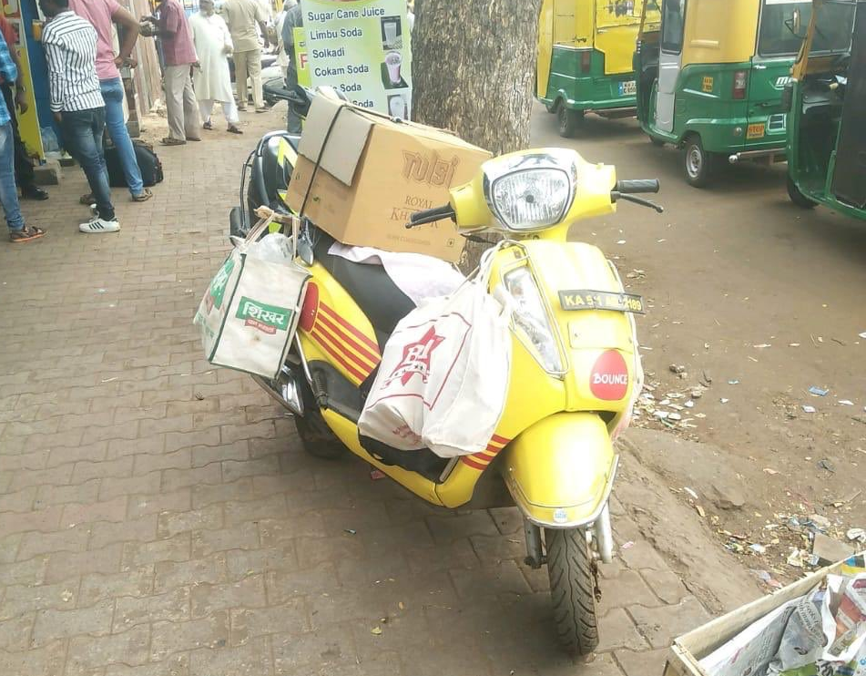
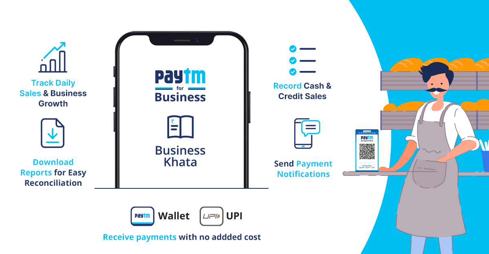
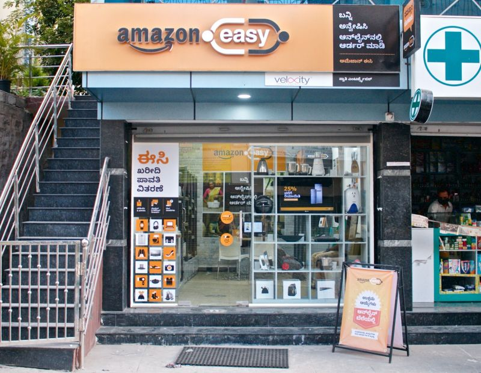
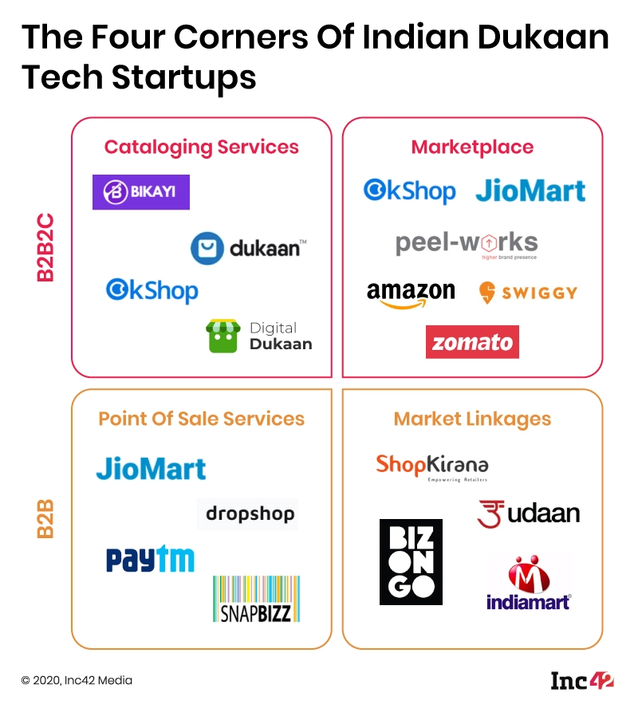

There are 12 million Kirana stores across India, and they account for around 95 percent of the country's roughly $500 billion food and grocery market, according to the industry estimates. Such mom-and-pop stores are easily accessible to majority of households all over India. Having leveraged thr trust from the neighbourhood communities, they still remain to be a go-to place for all daily needs.

> The Kirana store owners are some of the most enterprising people in all of India.

Although in Tier II and III they remain to dominate the hyperlocal market, however these stores can be seen dying in Tier I cities where Swiggy, Grofers, Big basket, and offline supermarkets are taking control. They seem to be spreading fast in Tier II and III cities, however, they kirana stores are here to say because they are being looked at by businesses as an opportunity to grow and expand.

## How is it lucrative?

The greatest strength for these Kirana store is their ubiquity and nurtured trust from the friendly neighbourhood. The three crore merchants and kirana shop owners, who generate direct and indirect livelihoods for over 20 crore people, form the backbone of India's commerce ecosystem. 

> “FMCGs, large retailers and financial services companies should recognise that the kirana store is the new local touchpoint and their conduit into the daily life of a trusting consumer,” EY said.

[Bounce Kirana](https://breadlake.in/kirana) is a wonderful example highlighting how kiranas can be strategically utilised to solving for mobility in smaller towns of India and build revenue in a way that is never thought. Catering to the last-mile connectivity, supply chain on a scooter, and distributed ownership. Surprisingly, there has been a positive movement towards the adoption of technology by such Kirana stores.

Also, JioMart, Dunzo, Swiggy and likes want to ride the trust earned by India’s kirana stores. More so ever since COVID-19 wherein people started panic-shopping for groceries from their nearest stores and resorting to getting it delivered instantly. Consumer spending at kirana stores are still 22% higher than pre-Covid levels.

> Kirana stores – not just a stone’s throw away but also a button away

According to a survey by EY India, 40% of kirana store owners said that they want to partner with online delivery and supply platforms as they feel it can help them grow and tide over in these testing times. Since India's hyperlocal market is vast, it produces a great opportunity for them to scale horizontally. The same holds true for payments as these stores opens up immense opportunity to enabling a larger audience under the digital payments umbrella.

## Kirana as a Service

The Kirana Tech sector is getting fiercer by everyday enabling business to expand in the remotest of the home. Hence, Kirana as a Service seems like a go-to model for a lot of sectors in terms of both expansion and revenue genration.

### Fintech

Digital payments platform PhonePe aims to offer small merchants in semi-urban and rural areas end-to-end control of the payment process. PhonePe is all set to bridge this gap with its multiple offerings. It offers its merchant partners a personalised store page on the PhonePe app, allowing them to list their store timings, share their product catalogue, and promote home delivery options, thereby reaching out to a much wider customer base.

At the same time, Kirana stores opt for Paytm Business Khata to avoid cash. With this, the merchants can send payment notifications to their customers that have their billing history. The customer can simply make payment by clicking on the same link and pay through their preferred mode of payment including Paytm Wallet, Paytm UPI, cards, or net banking.

This sector is hot because fintech has been booming for quite sometime and these startups are aiming to target these mom and pop stores with a larger reach. Another thing I can forsee for these kirana stores to have enabled is Buy Now Pay Later(BNPL) service. Traditionally, kirana do lend out money to its loyal customers and clear the bills at the end of the month, hence this model seemed to sit perfectly in this case.

### Retail

JioMart has already offered these brick and mortar stores for greater demand generation from taking the store online and leveraging the existing Jio customer base. Also, converting the kirana’s existing stores in less than 48 hours into refreshed self-service stores, thereby transforming their customer experience completely is underway and will open doors to revolutionalise the Kirana Tech.

Online grocery retailer Big Basket had initially planned to use the kirana store as a last-mile delivery agent, but later decided to opt for the online cash and carry model. Even Grofers has converted around 200 stores in and around Delhi into Grofers branded stores and manages their inventory. It also has 7,000 network stores, which could be kiranas, beauty parlours or gyms, which it uses as micro warehouses and delivers to customers from there. Metro Cash & Carry has also launched 'Kirana Success Centre'. It aims to empower the kirana owners with a one-stop  digitisation solution to help them attract more footfall and profitability.

However, the approach taken by e-tail giants like Amazon and Flipkart was a little different here. They aim to leverage these stores for speed of delivery and to leverage their customer relationship skills. Amazon launched an ‘I have space’ program to partner with local store owners, who would both store as well as deliver goods in their localities because vague landmarks like ‘behind the temple’ makes the adoption of hyperlocal very necessary.

> "The kirana ecosystem symbolises the entrepreneurship spirit of India. We are already seeing a strong willingness to embrace technology with tens of thousands of stores across the country acting as our last-mile delivery partners or assisted shopping points, enabling millions of remote customers to experience online shopping, while simultaneously increasing their earnings and scaling with Amazon," says Amit Agarwal, Senior VP and Country Head, Amazon India.

As a part of this program, Amazon Easy stores were made operational to offer a touch-and-feel product experience through a physical product display. Staff in these shops teach customers how to search for products, pick the right size, and help order it who might be still hesitant about ordering online. Flipkart has a similar program. They work with 1.6 million shops and kiranas while Amazon has only a few thousands but are hoping to scale exponentially.

Undoubtedly, the rise of retail tech startups in India, targeting the mom-and-pop stores as well as other retail outlets is on the peak for the time being leading to emergence of many retail tech startup. This Kirana digitization wave is here to stay and Kirana-as-a-Service will remain to bloom and pose as opportunities for many business out there.

