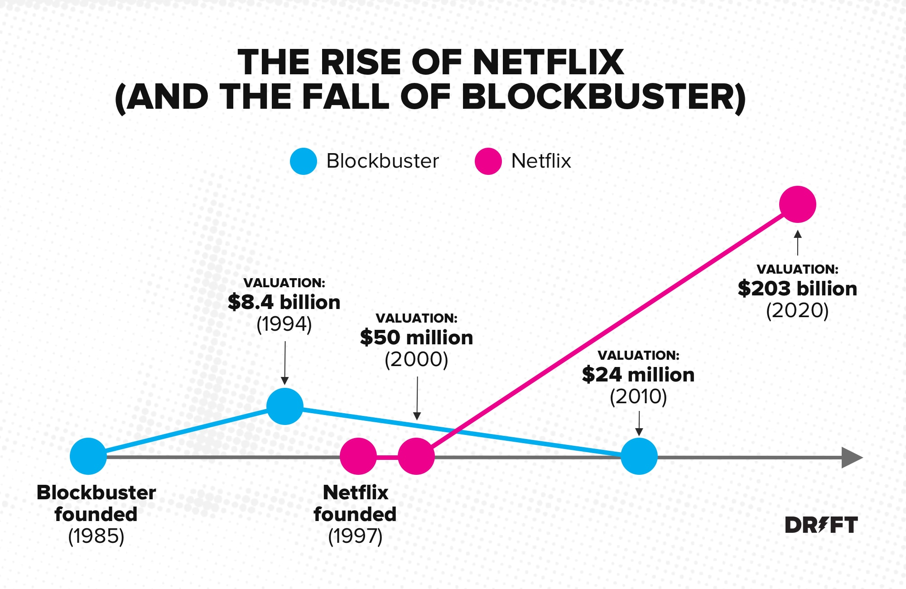
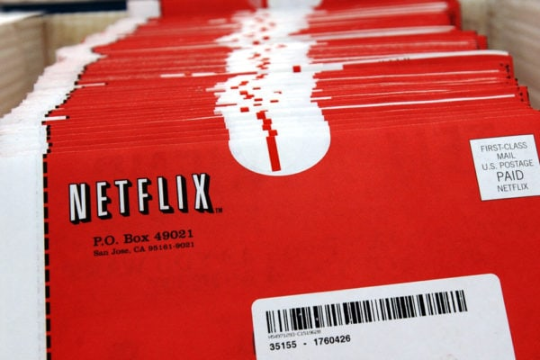

Netflix is entering into e-commerce space. Why ? The answer maybe as simple as it may sound, to sustain profits among its equally worthy competitors.

## Backstory

Before Netflix started, Blockbuster was the undisputed champion of the video rental industry. Between 1985 and 1992, the brick-and-mortar rental chain grew from its first location (in Dallas, Texas) to more than 2,800 locations around the world. It was in fact, at a walking distance for 90% of Americans. However, Blockbuster didn't have a subscription model and majority of profits from its business was as a part of heavy late fees levied  to its customers and this is what sowed the idea of Netflix.

Hence, Netflix started as a video rental-by-mail service as a subscription based model and without any late fees clause. The Netflix subscription service debuts, offering members unlimited DVD rentals without due dates, late fees, or monthly rental limits. It immediately gained traction but was very new to the market. n 2004, Blockbuster did launch a Netflix-like online DVD rental platform, and even abandoned their unpopular (but lucrative) late fees for overdue rentals. It was expected that Blockbuster will boom specially because of the network of Blockbuster stores facilitating easier transportation but clearly it didn't happen. By 2006, subscribers for Blockbuster’s online services had grown to more than 2 million. Meanwhile, in that same year, the number of Netflix subscribers reached 6.3 million.

## Hurdles on the way

Another competitor here was Walmart using the Leader pricing policy.

> Leader pricing strategy is a type of Promotional Pricing in which the retailers or other small businesses set lowest prices for the products. This price typically is either set by making profit equal to zero or even negative. This is done to attract more customers to buy the product.

Walmart started selling DVDs for cheaper to attract customers and indulge them in buying more, hence overall profitability. This cost Netflix a lot, and it clearly needed something stronger to fight the battle. In 2010, Netflix was signing deals with names like Sony, Paramount, Lionsgate, and Disney to help them grab a 20% market share of North American viewing traffic. Hence in 2007, streaming was introduced, allowing members to instantly watch series and films and partners with consumer electronics brands to allow streaming on Xbox 360, Blu-ray players and TV set-top boxes.

## What Now?

Cut to 2021, it's again facing the same competition from other OTT platforms likes of Disney, HBO who earn a lot from theatre releases and are pulling out their content from Netflix and feature on their platforms. This was long anticipated by Netflix and hence it started producing its own content in the form of Netflix originals. Yet, unlike HBO and like of such, the only source of revenue for these is the Netflix subscriptions because these originals don't make their way to the big screen. 

Also, Amazon is using the same Leader pricing through the Prime membership to attract customers to buy more products by offering them with Prime's content and giving tough fight to Netflix. Hence, it becomes very crucial for Netflix to expand its reach and not solely depend on subscription fees. Hence, they're trying to create a [marketplace for merchandise](https://www.livemint.com/technology/apps/netflix-enters-e-commerce-space-with-new-online-store-to-sell-show-related-merch/amp-11623574220818.html?__twitter_impression=true) that was originally used in the set of famous Netflix Originals catering to the loyal fans for the respective shows. This will enable them to have alternate sources of revenue to continue producing contect for us to binge watch.